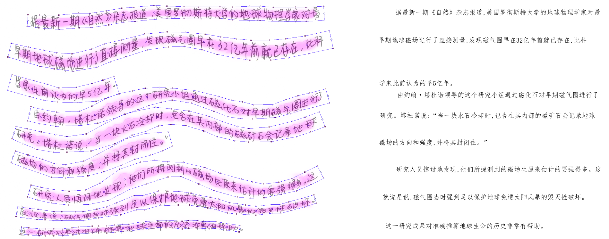
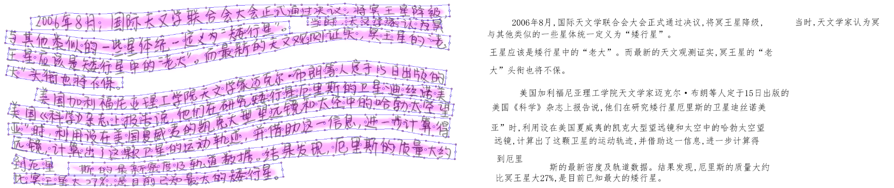

# Robust End-to-End Offline Chinese Handwriting Text Page Spotter with Text Kernel
[Paper Link](https://arxiv.org/pdf/2107.01547.pdf)






The addresses of dgrl or image files need to be specified in the code.

weight of hwdb2:[Baidu(78j0)](https://pan.baidu.com/s/1RhLz2gNZK_bApd4qAS5BPQ)

## Data Preparation
You can refer to [decode_page_with_box.py](./dataset/decode_page_with_box.py) for data processing of HWDB2.
The format of the label: x1 y1 x2 y2 x3 y3 x4 y4,label
```
page_imgs
│   0.png
│   2.png   
│		...
gt
│   gt_0.txt
│   gt_1.txt
|		...
```


## reference
https://github.com/whai362/pan_pp.pytorch

https://github.com/gpleiss/efficient_densenet_pytorch